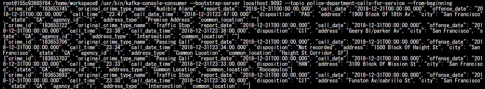
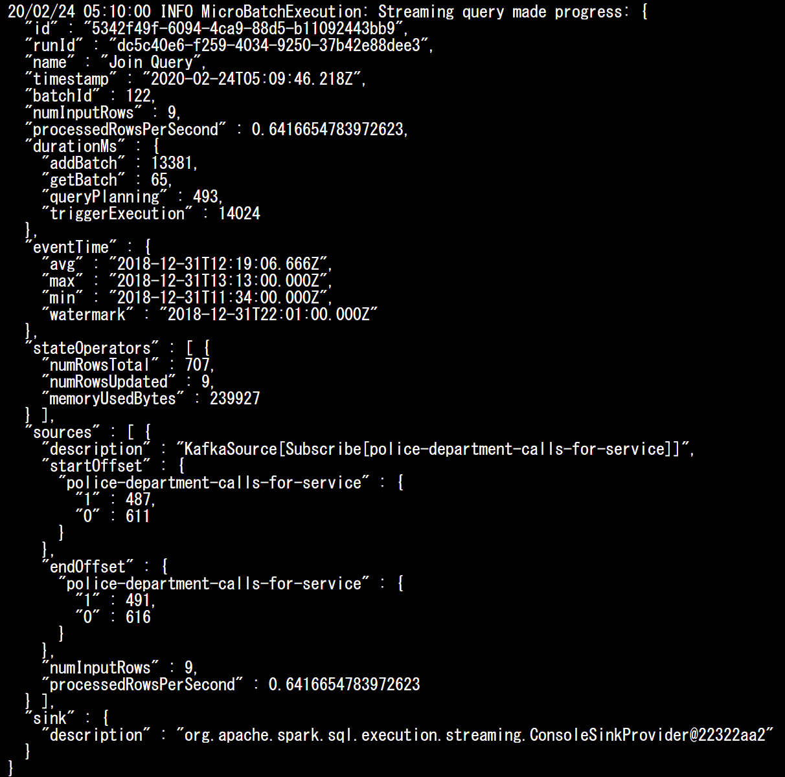
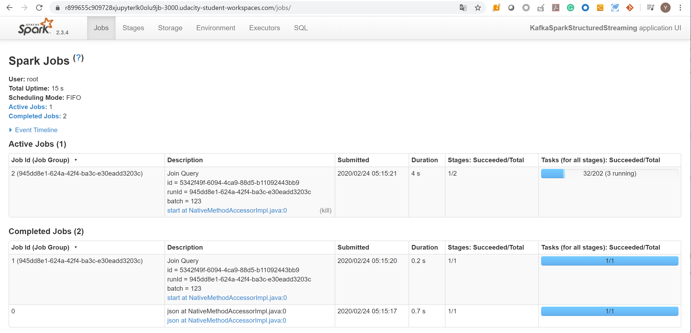

# SF Crime Statistics with Spark Streaming

## Project Overview
In this project, you will be provided with a real-world dataset, extracted from Kaggle, on San Francisco crime incidents, and you will provide statistical analyses of the data using Apache Spark Structured Streaming. You will draw on the skills and knowledge you've learned in this course to create a Kafka server to produce data, and ingest data through Spark Structured Streaming.

## Development Environment
You may choose to create your project in the workspace we provide here, or if you wish to develop your project locally, you will need to set up your environment properly as described below:

- Spark 2.4.3
- Scala 2.11.x
- Java 1.8.x
- Kafka build with Scala 2.11.x
- Python 3.6.x or 3.7.x

### Environment Setup (Only Necessary if You Want to Work on the Project Locally on Your Own Machine)
##### For Macs or Linux:
- Download Spark from https://spark.apache.org/downloads.html. Choose "Prebuilt for Apache Hadoop 2.7 and later."
- Unpack Spark in one of your folders (I usually put all my dev requirements in /home/users/user/dev).
- Download binary for Kafka from this location https://kafka.apache.org/downloads, with Scala 2.11, version 2.3.0. Unzip in your local directory where you unzipped your Spark binary as well. Exploring the Kafka folder, you’ll see the scripts to execute in bin folders, and config files under config folder. You’ll need to modify zookeeper.properties and server.properties.
- Download Scala from the official site, or for Mac users, you can also use brew install scala, but make sure you download version 2.11.x.
- Run below to verify correct versions:
```
java -version
scala -version
```
Make sure your ~/.bash_profile looks like below (might be different depending on your directory):
```
export SPARK_HOME=/Users/dev/spark-2.4.3-bin-hadoop2.7
export JAVA_HOME=/Library/Java/JavaVirtualMachines/jdk1.8.0_181.jdk/Contents/Home
export SCALA_HOME=/usr/local/scala/
export PATH=$JAVA_HOME/bin:$SPARK_HOME/bin:$SCALA_HOME/bin:$PATH
```
##### For Windows:
Please follow the directions found in this helpful StackOverflow post: https://stackoverflow.com/questions/25481325/how-to-set-up-spark-on-windows

## Project Directions

### Starter Code
You can find three Python files that are starter code, the project dataset, and some other necessary resources in a zip file called "SF Crime Data Project Files" in the Resources tab in the left sidebar of your classroom:

- `producer_server.py`
- `kafka_server.py`
- `data_stream.py`
- `police-department-calls-for-service.json`
- `radio_code.json`
- `start.sh`
- `requirements.txt`

These files are also included in the Project Workspace.

### Files You Need to Edit in Your Project Work
These starter code files should be edited:

- `producer_server.py`
- `data_stream.py`
- `kafka_server.py`

The following file should be created separately for you to check if your kafka_server.py is working properly:

- `consumer_server.py`


### Beginning the Project
This project requires creating topics, starting Zookeeper and Kafka servers, and your Kafka bootstrap server. You’ll need to choose a port number (e.g., 9092, 9093..) for your Kafka topic, and come up with a Kafka topic name and modify the zookeeper.properties and server.properties appropriately.

#### Local Environment
- Install requirements using ./start.sh if you use conda for Python. If you use pip rather than conda, then use pip install -r requirements.txt.

- Use the commands below to start the Zookeeper and Kafka servers. You can find the bin and config folder in the Kafka binary that you have downloaded and unzipped.
```
bin/zookeeper-server-start.sh config/zookeeper.properties
bin/kafka-server-start.sh config/server.properties
```
- You can start the bootstrap server using this Python command: python producer_server.py.
#### Workspace Environment
- Modify the zookeeper.properties and producer.properties given to suit your topic and port number of your choice. Start up these servers in the terminal using the commands:
```
/usr/bin/zookeeper-server-start config/zookeeper.properties
/usr/bin/kafka-server-start config/server.properties
```

- You’ll need to open up two terminal tabs to execute each command.

- Install requirements using the provided ./start.sh script. This needs to be done every time you re-open the workspace, or anytime after you've refreshed, or woken up, or reset data, or used the "Get New Content" button in this workspace.

- In the terminal, to install other packages that you think are necessary to complete the project, use conda install <package_name>. You may need to reinstall these packages every time you re-open the workspace, or anytime after you've refreshed, or woken up, or reset data, or used the "Get New Content" button in this workspace.

##### Logging
A customized `log4j.properties` is included in this repository. It is needed to copy to the appropriate folder.
```
cp log4j.properties /opt/spark-2.3.4-bin-hadoop2.7/conf/
```

## Step 1
- The first step is to build a simple Kafka server.
- Complete the code for the server in producer_server.py and kafka_server.py.

```
python kafka_server.py
```
### Local Environment
- To see if you correctly implemented the server, use the command below to see your output.
```
bin/kafka-console-consumer.sh --bootstrap-server localhost:9092 --topic police-department-calls-for-service --from-beginning
```

### Workspace Environment
- To start kafka-consumer-console, use the command /usr/bin/kafka-consumer-console.
```
/usr/bin/kafka-console-consumer --bootstrap-server localhost:9092 --topic police-department-calls-for-service --from-beginning
```


**Take a screenshot of your kafka-consumer-console output. You will need to include this screenshot as part of your project submission.**



## Step 2
- Apache Spark already has an integration with Kafka brokers, so we would not normally need a separate Kafka consumer. However, we are going to ask you to create one anyway. Why? We'd like you to create the consumer to demonstrate your understanding of creating a complete Kafka Module (producer and consumer) from scratch. In production, you might have to create a dummy producer or consumer to just test out your theory and this will be great practice for that.
- Implement all the TODO items in data_stream.py. You may need to explore the dataset beforehand using a Jupyter Notebook.
Do a spark-submit using this command: 
```
spark-submit --packages org.apache.spark:spark-sql-kafka-0-10_2.11:2.3.4 --master local[*] --conf spark.ui.port=3000 data_stream.py
```
- Take a screenshot of your progress reporter after executing a Spark job. **You will need to include this screenshot as part of your project submission.**



- Take a screenshot of the Spark Streaming UI as the streaming continues. **You will need to include this screenshot as part of your project submission.**



*Note:* I couldn't get "Streaming" Tab on the UI and found a comment at Student Hub, which says that it was because the Spark version of the workspace was different from the version of Lesson 5 'Structured Streaming on Spark UI'.
So, I put the above screenshot of Spark UI. 

## Step 3
Write the answers to these questions in the README.md doc of your GitHub repo:

**1. How did changing values on the SparkSession property parameters affect the throughput and latency of the data?**

I checked available parameters with the Apache Documents below:

http://spark.apache.org/docs/latest/configuration.html#spark-streaming

|Property Name|Default|Meaning|
|:---|:---|:---|
|spark.streaming.backpressure.enabled|false|	Enables or disables Spark Streaming's internal backpressure mechanism (since 1.5). This enables the Spark Streaming to control the receiving rate based on the current batch scheduling delays and processing times so that the system receives only as fast as the system can process. Internally, this dynamically sets the maximum receiving rate of receivers. This rate is upper bounded by the values spark.streaming.receiver.maxRate and spark.streaming.kafka.maxRatePerPartition if they are set (see below).|
|spark.streaming.backpressure.initialRate|not set|This is the initial maximum receiving rate at which each receiver will receive data for the first batch when the backpressure mechanism is enabled.|
|**spark.streaming.blockInterval**|200ms|Interval at which data received by Spark Streaming receivers is chunked into blocks of data before storing them in Spark. Minimum recommended - 50 ms. See the [performance tuning](http://spark.apache.org/docs/latest/streaming-programming-guide.html#level-of-parallelism-in-data-receiving) section in the Spark Streaming programing guide for more details.|
|**spark.streaming.receiver.maxRate**|not set|	Maximum rate (number of records per second) at which each receiver will receive data. Effectively, each stream will consume at most this number of records per second. Setting this configuration to 0 or a negative number will put no limit on the rate. See the [deployment guide](http://spark.apache.org/docs/latest/streaming-programming-guide.html#deploying-applications) in the Spark Streaming programing guide for mode details.|
|spark.streaming.receiver.writeAheadLog.enable|false|Enable write-ahead logs for receivers. All the input data received through receivers will be saved to write-ahead logs that will allow it to be recovered after driver failures. See the [deployment guide](http://spark.apache.org/docs/latest/streaming-programming-guide.html#deploying-applications) in the Spark Streaming programing guide for more details.|
|spark.streaming.unpersist|true|Force RDDs generated and persisted by Spark Streaming to be automatically unpersisted from Spark's memory. The raw input data received by Spark Streaming is also automatically cleared. Setting this to false will allow the raw data and persisted RDDs to be accessible outside the streaming application as they will not be cleared automatically. But it comes at the cost of higher memory usage in Spark.|
|spark.streaming.stopGracefullyOnShutdown|false|If true, Spark shuts down the StreamingContext gracefully on JVM shutdown rather than immediately.|
|spark.streaming.kafka.maxRatePerPartition|not set|Maximum rate (number of records per second) at which data will be read from each Kafka partition when using the new Kafka direct stream API. See the Kafka Integration guide for more details.|
|spark.streaming.kafka.minRatePerPartition|1|Minimum rate (number of records per second) at which data will be read from each Kafka partition when using the new Kafka direct stream API.|
|spark.streaming.kafka.maxRetries|1|Maximum number of consecutive retries the driver will make in order to find the latest offsets on the leader of each partition (a default value of 1 means that the driver will make a maximum of 2 attempts). Only applies to the new Kafka direct stream API.|
|spark.streaming.ui.retainedBatches|1000|How many batches the Spark Streaming UI and status APIs remember before garbage collecting.|
|spark.streaming.driver.writeAheadLog.closeFileAfterWrite|false|Whether to close the file after writing a write-ahead log record on the driver. Set this to 'true' when you want to use S3 (or any file system that does not support flushing) for the metadata WAL on the driver.|
|spark.streaming.receiver.writeAheadLog.closeFileAfterWrite|false|Whether to close the file after writing a write-ahead log record on the receivers. Set this to 'true' when you want to use S3 (or any file system that does not support flushing) for the data WAL on the receivers.|


**2. What were the 2-3 most efficient SparkSession property key/value pairs? Through testing multiple variations on values, how can you tell these were the most optimal?**

## Project Submission
You will submit a link to your GitHub repo, with the files you've created: producer_server.py, kafka_server.py, data_stream.py, and consumer_server.py. The README.md doc in your GitHub repo should contain **your responses to the two questions from Step 3**.

Your project submission should also include a zip file containing **the three screenshots you've taken**.

Before you submit your project, please check your work against the project [rubric](rubic.md).
